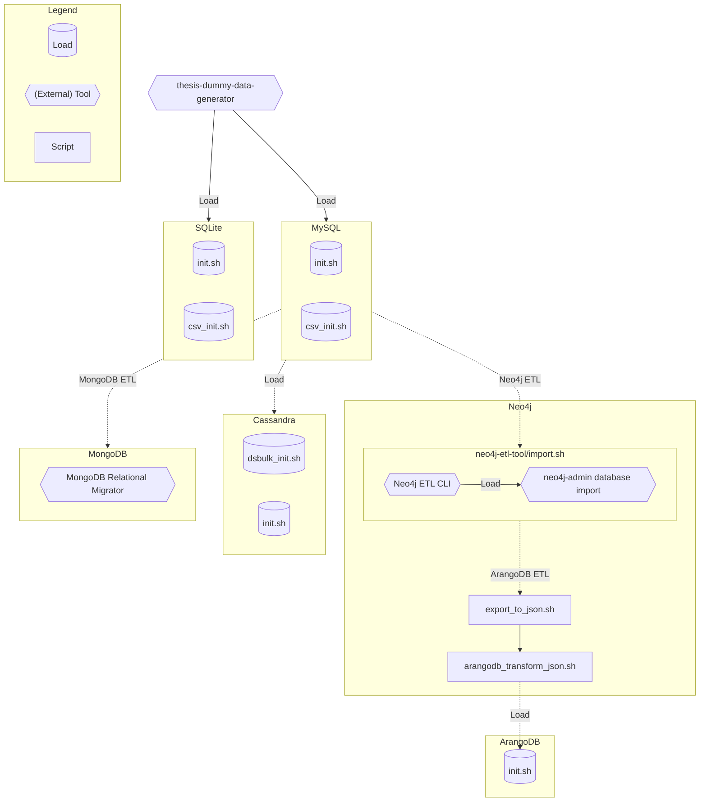

# ETL Flow

```mermaid
flowchart TD
    A{{"`thesis-dummy-data-generator`"}} -- Load --> MySQL
    A -- Load --> SQLite
    MySQL -. Neo4j ETL .-> neo4j-etl-tool
    D4 -. Load .-> E1
    MySQL -. Load .-> Cassandra
    MySQL -. MongoDB ETL .-> MongoDB

    subgraph MySQL
    B1[("`init.sh`")]
    B2[("`csv_init.sh`")]
    end
    subgraph SQLite
    C1[("`init.sh`")]
    C2[("`csv_init.sh`")]
    end
    subgraph Neo4j
        subgraph neo4j-etl-tool ["`neo4j-etl-tool/import.sh`"]
        D1{{"Neo4j ETL CLI"}} -- Load --> D2{{"`neo4j-admin database import`"}}
        end
    neo4j-etl-tool -. ArangoDB ETL .-> D3["`export_to_json.sh`"]
    D3 --> D4["`arangodb_transform_json.sh`"]
    end
    subgraph ArangoDB
    E1[("`init.sh`")]
    end
    subgraph Cassandra
    F1[("`dsbulk_init.sh`")]
    F2[("`init.sh`")]
    end
    subgraph MongoDB
    G1{{"MongoDB Relational Migrator"}}
    end

    %% Legend
    subgraph Legend
    Load[(Load)]
    Tool{{"(External) Tool"}}
    Script[Script]
    end
```