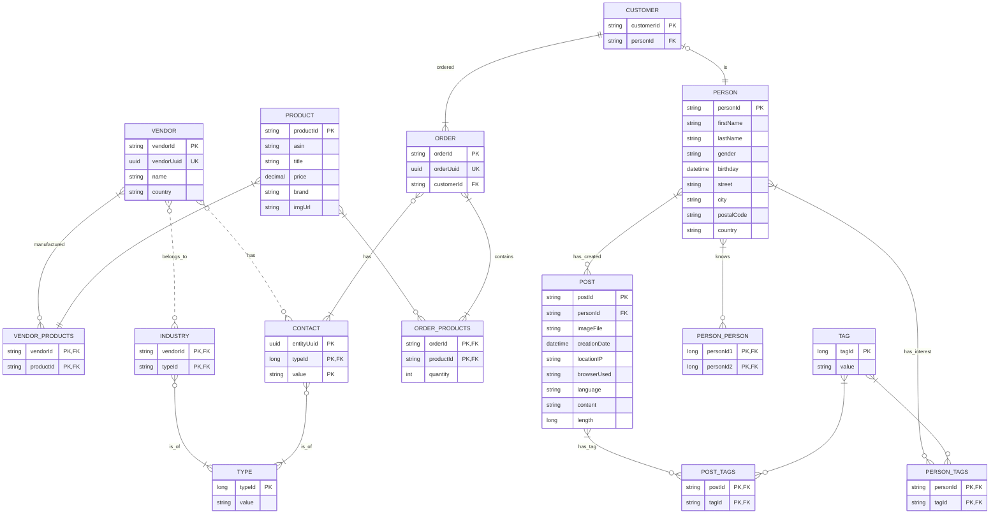
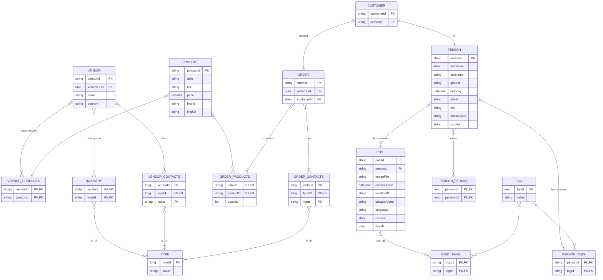
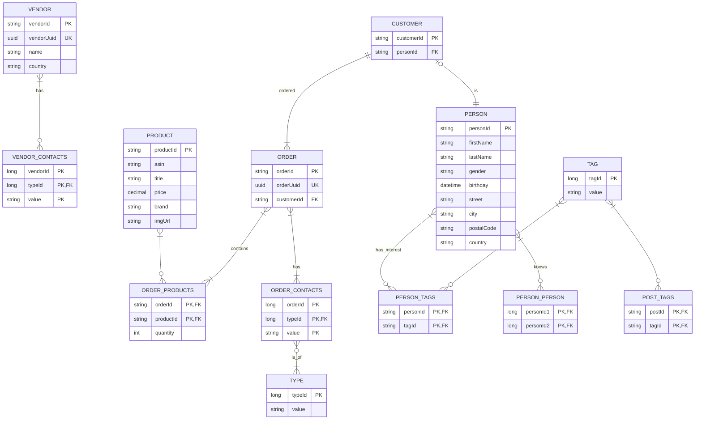

## Schema 1

```mermaid
erDiagram
    VENDOR }|--o{ VENDOR_PRODUCTS : "manufactured"
    VENDOR }o..o{ CONTACT : "has"
    VENDOR }o..o{ INDUSTRY : "belongs_to"

    INDUSTRY }o--|{ TYPE : "is_of"

    CONTACT }o--|{ TYPE : "is_of"

    PRODUCT }|--|| VENDOR_PRODUCTS : ""
    PRODUCT }|--o{ ORDER_PRODUCTS : ""

    CUSTOMER ||--|{ ORDER : "ordered"
    CUSTOMER |o--|| PERSON : "is"

    ORDER }|--|{ ORDER_PRODUCTS : "contains"
    ORDER }o--|{ CONTACT : "has"

    PERSON }|--o{ POST : "has_created"
    PERSON }|--o{ PERSON_TAGS : "has_interest"
    PERSON }|--o{ PERSON_PERSON : "knows"

    POST }|--o{ POST_TAGS : "has_tag"

    TAG }|--o{ POST_TAGS : ""
    TAG }|--o{ PERSON_TAGS : ""

    VENDOR {
        string vendorId PK
        uuid vendorUuid UK
        string name
        string country 
    }

    PRODUCT {
        string productId PK
        string asin
        string title
        decimal price
        string brand
        string imgUrl
    }

    VENDOR_PRODUCTS {
        string vendorId PK, FK
        string productId PK, FK
    }

    CONTACT {
        uuid entityUuid PK
        long typeId PK, FK
        string value PK
    }

    INDUSTRY {
        string vendorId PK, FK
        string typeId PK, FK
    }

    TYPE {
        long typeId PK
        string value
    }

    ORDER {
        string orderId PK
        uuid orderUuid UK
        string customerId FK
    }

    ORDER_PRODUCTS {
        string orderId PK, FK
        string productId PK, FK
        int quantity
    }

    TAG {
        long tagId PK
        string value
    }

    CUSTOMER {
        string customerId PK
        string personId FK
    }

    PERSON {
        string personId PK
        string firstName
        string lastName
        string gender
        datetime birthday
        string street
        string city
        string postalCode
        string country
    }

    PERSON_PERSON {
        long personId1 PK, FK
        long personId2 PK, FK
    }

    PERSON_TAGS {
        string personId PK, FK
        string tagId PK, FK
    }

    POST {
        string postId PK
        string personId FK
        string imageFile
        datetime creationDate
        string locationIP
        string browserUsed
        string language
        string content
        long length
    }

    POST_TAGS {
        string postId PK, FK
        string tagId PK, FK
    }
```

## Schema 2

- Table Contact split into Vendor_Contact and Order_Contact
- Removed all UUIDs

```mermaid
erDiagram
    VENDOR }|--o{ VENDOR_PRODUCTS : "manufactured"
    VENDOR }|--o{ VENDOR_CONTACTS : "has"
    VENDOR }o..o{ INDUSTRY : "belongs_to"

    INDUSTRY }o--|{ TYPE : "is_of"

    VENDOR_CONTACTS }o--|{ TYPE : "is_of"

    PRODUCT }|--|| VENDOR_PRODUCTS : ""
    PRODUCT }|--o{ ORDER_PRODUCTS : ""

    CUSTOMER ||--|{ ORDER : "ordered"
    CUSTOMER |o--|| PERSON : "is"

    ORDER }|--|{ ORDER_PRODUCTS : "contains"
    ORDER }|--|{ ORDER_CONTACTS : "has"

    ORDER_CONTACTS }o--|{ TYPE : "is_of"

    PERSON }|--o{ POST : "has_created"
    PERSON }|--o{ PERSON_TAGS : "has_interest"
    PERSON }|--o{ PERSON_PERSON : "knows"

    POST }|--o{ POST_TAGS : "has_tag"

    TAG }|--o{ POST_TAGS : ""
    TAG }|--o{ PERSON_TAGS : ""

    VENDOR {
        string vendorId PK
        uuid vendorUuid UK
        string name
        string country 
    }

    PRODUCT {
        string productId PK
        string asin
        string title
        decimal price
        string brand
        string imgUrl
    }

    VENDOR_CONTACTS {
        long vendorId PK
        long typeId PK, FK
        string value PK
    }

    VENDOR_PRODUCTS {
        string vendorId PK, FK
        string productId PK, FK
    }

    INDUSTRY {
        string vendorId PK, FK
        string typeId PK, FK
    }

    TYPE {
        long typeId PK
        string value
    }

    ORDER {
        string orderId PK
        uuid orderUuid UK
        string customerId FK
    }

    ORDER_CONTACTS {
        long orderId PK
        long typeId PK, FK
        string value PK
    }

    ORDER_PRODUCTS {
        string orderId PK, FK
        string productId PK, FK
        int quantity
    }

    TAG {
        long tagId PK
        string value
    }

    CUSTOMER {
        string customerId PK
        string personId FK
    }

    PERSON {
        string personId PK
        string firstName
        string lastName
        string gender
        datetime birthday
        string street
        string city
        string postalCode
        string country
    }

    PERSON_PERSON {
        long personId1 PK, FK
        long personId2 PK, FK
    }

    PERSON_TAGS {
        string personId PK, FK
        string tagId PK, FK
    }

    POST {
        string postId PK
        string personId FK
        string imageFile
        datetime creationDate
        string locationIP
        string browserUsed
        string language
        string content
        long length
    }

    POST_TAGS {
        string postId PK, FK
        string tagId PK, FK
    }
```

## Schema 3 (reduced for queries)

```mermaid
erDiagram
    %% VENDOR }|--o{ VENDOR_PRODUCTS : "manufactured"
    VENDOR }|--o{ VENDOR_CONTACTS : "has"
    %% VENDOR }o..o{ INDUSTRY : "belongs_to"

    %% INDUSTRY }o--|{ TYPE : "is_of"

    %% VENDOR_CONTACTS }o--|{ TYPE : "is_of"

    %% PRODUCT }|--|| VENDOR_PRODUCTS : ""
    PRODUCT }|--o{ ORDER_PRODUCTS : ""

    CUSTOMER ||--|{ ORDER : "ordered"
    CUSTOMER |o--|| PERSON : "is"

    ORDER }|--|{ ORDER_PRODUCTS : "contains"
    ORDER }|--|{ ORDER_CONTACTS : "has"

    ORDER_CONTACTS }o--|{ TYPE : "is_of"

    %% PERSON }|--o{ POST : "has_created"
    PERSON }|--o{ PERSON_TAGS : "has_interest"
    PERSON }|--o{ PERSON_PERSON : "knows"

    %% POST }|--o{ POST_TAGS : "has_tag"

    TAG }|--o{ POST_TAGS : ""
    TAG }|--o{ PERSON_TAGS : ""

    VENDOR {
        string vendorId PK
        uuid vendorUuid UK
        string name
        string country 
    }

    PRODUCT {
        string productId PK
        string asin
        string title
        decimal price
        string brand
        string imgUrl
    }

    VENDOR_CONTACTS {
        long vendorId PK
        long typeId PK, FK
        string value PK
    }

    %% VENDOR_PRODUCTS {
    %%     string vendorId PK, FK
    %%     string productId PK, FK
    %% }

    %% INDUSTRY {
    %%     string vendorId PK, FK
    %%     string typeId PK, FK
    %% }

    TYPE {
        long typeId PK
        string value
    }

    ORDER {
        string orderId PK
        uuid orderUuid UK
        string customerId FK
    }

    ORDER_CONTACTS {
        long orderId PK
        long typeId PK, FK
        string value PK
    }

    ORDER_PRODUCTS {
        string orderId PK, FK
        string productId PK, FK
        int quantity
    }

    TAG {
        long tagId PK
        string value
    }

    CUSTOMER {
        string customerId PK
        string personId FK
    }

    PERSON {
        string personId PK
        string firstName
        string lastName
        string gender
        datetime birthday
        string street
        string city
        string postalCode
        string country
    }

    PERSON_PERSON {
        long personId1 PK, FK
        long personId2 PK, FK
    }

    PERSON_TAGS {
        string personId PK, FK
        string tagId PK, FK
    }

    %% POST {
    %%     string postId PK
    %%     string personId FK
    %%     string imageFile
    %%     datetime creationDate
    %%     string locationIP
    %%     string browserUsed
    %%     string language
    %%     string content
    %%     long length
    %% }

    POST_TAGS {
        string postId PK, FK
        string tagId PK, FK
    }
```